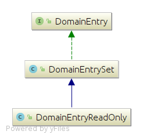

# Class diagram of DomainEntry

A domain entry represents the set of words/connections that points from one domain to the next. You can refer to [DomainStorage components](../pages/ODAGComponents.md) in order to understand what is a domain storage and its internals (Domains and connections)

## DomainEntry hierarchichy

 

[Click here to view the class diagram in details (e.g. fields and methods)](../resources/ClassDiag/DomainEntry/DomainEntry_details.png)

A domain entry could be classified into one of the following types:

 + **`DomainEntrySet`**: is a data structure that stores the set of word ids that points to the next domain. A word could represent a vertex in a `VertexInducedEmbedding` or an edge in an `EdgeInducedEmbedding`. `DomainEntrySet` is built and stored inside a DomainStroage during the ODAG building process. 
 + **`DomainEntrySetReadOnly`**: is similar to `DomainEntrySet` but optimized for storing a set of words for read-only storages. It is being built and used inside ReadOnly [DomainStorage](../pages/DomainStorage.md).
