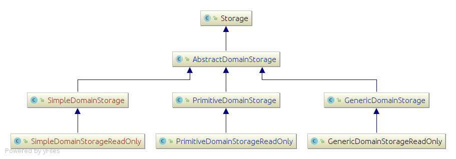

# Class diagram of Domain Storage

A domain storage is where the actual embeddings are being compressed and stored inside an ODAG. You can refer to [Domain Storage components](../pages/ODAGComponents.md) in order to understand what is a storage and its internals (Domains and connections)

## DomainStorage hierarchichy

 

[Click here to view the class diagram in details (e.g. fields and methods)](../resources/ClassDiag/DomainStorage/storage_details.png)

A domain storage could be classified into one of the following types:

 + **`SimpleDomainStorage`**: compress embeddings in the most compact format than the other regular ODAGs. Using this storage to save more memory has a tradeoff of increasing the processing time and that is due to the more spurious embeddings that are stored inside the the storage that need to be read and filtered. 
 + **`PrimitiveDomainStorage`**: compress embeddings inside ODAGs using primitive data structures from the [koloboke](https://koloboke.com/) framework. Which allows the primitive ODAGs to be more efficient in terms of memory utilization and runtime. 
 + **`GenericDomainStorage`**: compress embeddings inside ODAGs using generic data structures from the [java.util](https://docs.oracle.com/javase/8/docs/api/java/util/package-summary.html) and [java.util.concurrent](https://docs.oracle.com/javase/8/docs/api/java/util/concurrent/package-summary.html) frameworks. 

Each storage type has a read-only version that uses internal structures optimized for only reading from the storage. For example the read-only storage use [the read-only version of domain entries](../resources/pages/DomainEntry.md) which save space and time. Read-only storages are created by the ODAG master engine and then broadcasted to the worker engines at the beggining of each super step. The each engine reads/filters embeddings from those storages and create a new domain storage that will be used for saving the new expanded embeddings. Then after finishing the reading/filtering/exapansion process it returns those storages to the master engine. You can refer to the [ODAG engines components](../pages/EnginesComponents.md) to understand how that works.

<!--

#### Classes describtions:
| Class/Interface | Describtion|
| ------------------- | -------------- |
| SparkMasterEngine | The main interface for the spark master engines |
| SparkEmbeddingMasterEngine | Performs the master engine responsibilities and store the embeddings in their raw format rather than compressing them into ODAGs |
| ODAGMasterEngine | Performs the master engine responsibilities and compresses the embeddings into ODAGs |
| ODAGMasterEngineSP | The same as its parent but compresses the embeddings that follow the same pattern into a single ODAG (One-to-one correspondence) |
| ODAGMasterEngineMP | The same as its parent but each ODAG compresses the embeddings of more than one pattern (OneODAG-to-MultiplePatterns correspondence) |

-->