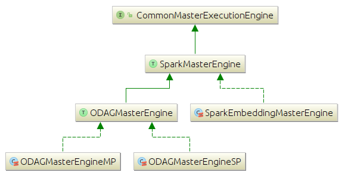
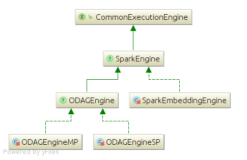

# Class diagrams of computation engines

This document describes the hierarchy diagram of the computation engines (Master/Workes)

## Master Engine

 

The master engine is the main engine running on the driver node and reponsible for the following:

 + Initializing the accumulators and the embeddings storage data structure (ODAG or Simple)
 + For each super step:
	 + Aggregating the resulting embeddings and accumulators from the previous super step
	 + Building worker engines, broadcast them the configurations and the list of aggregated ODAGs
	 + Waiting for all engines to finalize their computations and aggregate the resulting embeddings and accumulators

#### Classes describtions:
| Class/Interface | Describtion|
| ------------------- | -------------- |
| **SparkMasterEngine** | The main interface for the spark master engines |
| **SparkEmbeddingMasterEngine** | Performs the master engine responsibilities and store the embeddings in their raw format rather than compressing them into ODAGs |
| **ODAGMasterEngine** | An abstract parent class for those who will perform the master engine responsibilities and compress the embeddings into ODAGs |
| **ODAGMasterEngineSP** | Perform the reponsibilities inherited from its parent. And compresses the embeddings that follow the same pattern into a single ODAG (One-to-one correspondence) |
| **ODAGMasterEngineMP** | The same as its sibling **ODAGMasterEngineSP**  but each ODAG compresses the embeddings of more than one pattern (OneODAG-to-MultiplePatterns correspondence) |

***

## Worker Engines

 

Each engine is identified by a partition id and associated with a single thread that corresponds to a partition in Spark computation model. Each worker has the llifetime of one super step computation and responsible for the following:

+ Receiving a list of ODAGs at the beginning of each super step
+ Iterating over the embeddings stored inside each ODAG and expands each embedding
+ Aggregating the embeddings that result from the exapnsion and computation processes
+ Accumulating the number of processed/generated/output embeddings
+ Sends the aggregations and the accumulators stats to the master engine 

<!---
#### Classes describtions:
| Class/Interface | Describtion|
| ------------------- | -------------- |
| SparkEngine | |
| SparkEmbeddingEngine | |
| ODAGEngine | |
| ODAGEngineSP | |
| ODAGEngineMP | |
-->