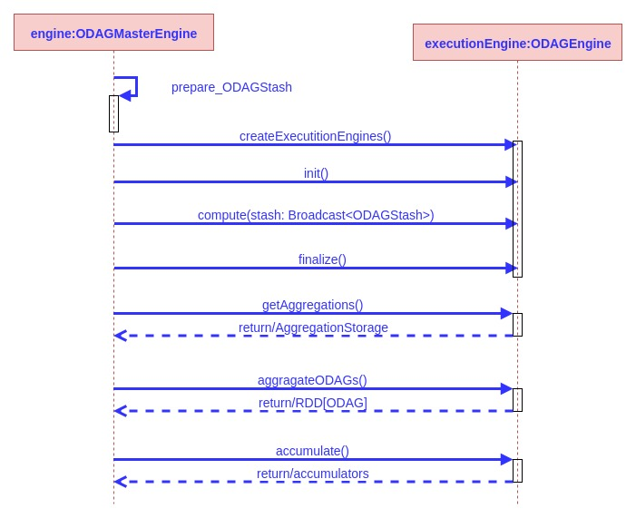

# Master/Worker engines interactions

This document describes the interaction between the master engine asn the worker engines though a sequence diagram

 

The following sequence of steps/method calls occur during the life time of the compute method of the master engine:

1. The master initializes the accumulators and prepares the stash that stores the odags from the previous step

2. The master creates a number of worker execution engines (**ODAGEngine**) equals to the number of partitions **(num_compute_threads * num_workers)**

3. Then the master broadcasts the stash of current ODAGs to the workers, and order them to start their computation process over those ODAGs

4. The master order the workers to finalize their work

5. Finally, the master retrieves the results from each engine in two forms:

	* **Aggregations**: which are the odags generated by each engine
	
	* **Accumulators**: which hold the counts of:
	
		* *Number of embeddings processed/read*
		
		* *Nuumber of embeddings generated*
		
		* *Number of embeddings written to the output directory determined by the **Output_Path** parameter*

