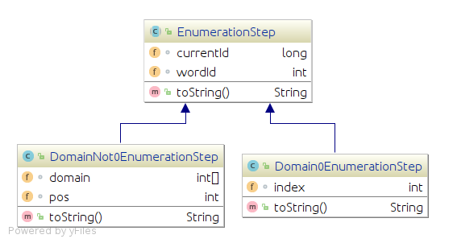

# Class diagram of EnumerationStep

This document describes the hierarchy diagram of the EnumerationStep

 

<!--
[Click here to view the class diagram in details(e.g. fields and methods)](./resources/StorageReader/EnumerationStep_details.png)
-->

Each enumeration step represents a word in a domain and its connections (list of words) top the next domain that will be enumerated in the next step:

An enumeration step is eaither one of the following types:
 + Domain0EnumerationStep: represents the first step (root) in the enumeration tree. The wordIds are enumerated from the first domain (i.e. Domain #0)
+ DomainNot0EnumerationStep: represents the following steps in the enumeration tree where each step represents a word in some domain and its connections (words) from that word to the next domain
...eqw
