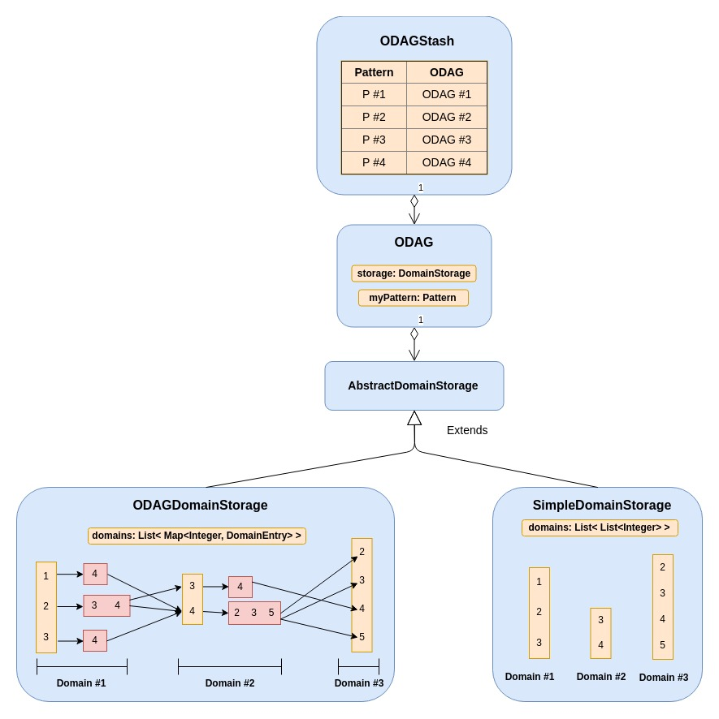

# Anatomy of the ODAG data structure

This document describes the internals of the ODAG data structure.

 

 

The most outter skin of the ODAG is the **ODAGStash**. Which stores a list of ODAGs in the form of  a map of key/value pairs, where each map entry has:
1. An **ODAG** object as the value
2. A **Pattern** object as the key that the corresponding odag follows
 
Each **ODAG** object encapsulates
1. An intenal storage of type **AbstractDomainStorage** that comes in many variations (Please refer to the class diagram of [AbstractDomianStorage](./resources/ClassDiag/ODAG/general.png))
2. **Pattern** which this ODAG follows
 
A **DomainStorage** is the core storage of an ODAG where the list of embeddings is compressed. 

There are two main methods of compression (Simple and ODAG that are illustated [here](./resources/)). Each domain storage consists of a list of maps, where each map represents a domain. A domain represents the 

