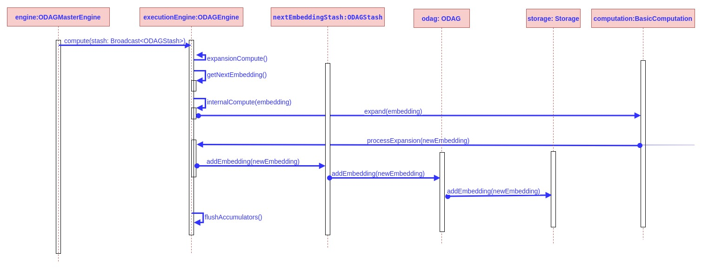

# Read/Expand/AddNewEmbedding sequence diagram

This document describes the sequence of interactions/method calls during the process of enumerating and expanding the stored embeddings in an ODAG then adding the new embeddings generated from the expand operation into new ODAGs

 

Each ODAGEngine works with two stashes of ODAGs:

1. An ODAG stash that was broadcasted by the master engine where:
	* Each machine/JVM holds in memory only one copy of this object which is shared among all threads/partitions in the same machine
	* It is used to read the embeddings stored from the previous step
	* Each engine reads its own blocks of embeddings from each ODAG

2. A new stash ***nextEmbeddingStash*** inside each engine which is used to store the new embeddings generated by that engine
 

The sequence of steps to enumerate and expand an embedding then add the new embeddings to the ***nextEmbeddingStash*** is as follows:

1. The master engine orders all the engines/partitions to start the computation process (*compute() -> expansionCompute()*)

2. Each engine reads an embedding - *getNextEmbedding()* - from the shared ODAG stash (The algorithm in **XXX** ensures balanced workload and no overlapping of the same work)

3. The embedding read gets expanded [ *internalCompute(embedding) -> expand(embedding)* ] - into new bigger embeddings

4. The new generated embeddings get filtered and those who survive the filteration process are added into ***nextEmbeddingStash***

5. When a stash adds an embedding ***e***, it searches for the appropriate ODAG to store ***e*** where the pattern of ***e*** is the same as the pattern of that ODAG. If the stash could not find a matching ODAG it creates a new ODAG for that embedding, add it to the new ODAG, store the new ODAG inside its map of (*pattern -> ODAG*) pairs

6. When adding a new embeddig into an ODAG, it adds the words of the new embeddings into the internal storage of the ODAG which is of type ***AbstractDomainStorage***

7. Finally, after an engine/partition finishes the *enumerate/expand/AddEmbedding* process for its share of workloads, it flushes the accumulators to the master engine

*** Note: you can refer to the [detailed representation](../ODAGComponents.md) of the internal structure of the ODAG/ODAGStash***
