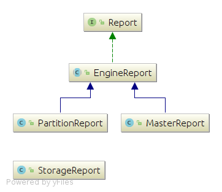

# Class diagram of the reports package

The report package is responsible for counting and gathering statistics that help monitoring the performance of the computation engines in a more fine grained view.

## Report hierarchichy

 

[Click here to view the class diagram in details (e.g. fields and methods)](../resources/ClassDiag/Reports/details.png)

Reports could be classified into two main types:

+ **`EngineReport`**: is a report generated at the end of each super step for both the master and worker engines:
	 + **`MasterReport`**: is a report about the ODAGMasterEngine that calculates the following:
	 	+ The size (in bytes) of each ODAG and each pattern
	 	+ Number if words in each domain for each ODAG
	 	+ Number if words in connections in each domain for each ODAG

	 + **`PartitionReport`**:  is a report about the ODAGEngine associated with each partion and calculates the following:
	 	+ Number of embeddings this engine has read from the shared ODAGs
	 	+ Number of spurious embeddings this engined has read from the shared ODAGs
 
 + **`StorageReport`** for each ODAG that contains the following numbers:
	  + Number of the actual true embeddings storaged in the ODAG
	  + Number of possible embeddings that could be enumerated while reading from the ODAG
	  + Number of embeddings read from the ODAG that has been been filtered yet
	  + Number of spurious embeddings
