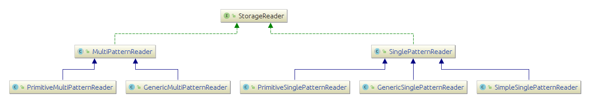

# Class diagram of Storage Reader

Each reader is associated with a thread/partition and responsible for enumerating/reading embeddings stored in an ODAG stoage. Those embeddings will go through a pipeline of filteration and expansion steps.

Every reader decides which parts of the ODAG to enumerate based on its partition ID and other parameters. That allows the workloads of the enumeration and expansion work be more load-balanced between the readers.

## Readers hierarchichy

 

[Click here to view the class diagram in details (e.g. fields and methods)](../resources/ClassDiag/StorageReader/StorageReader_details.png)

Readers could be classified into two main types:

 + **`SinglePatternReader`**: responsible for reading embeddings from SinglePatternODAGs. Single pattern readers could also be classified into three sub-types:
 	 + **Simple**: responsible for reading embeddings from ODAGs that compress the embeddings in more compact format than the regular ODAGs. 
	 + **Generic**: responsible for reading embeddings from ODAGs that compress them using generic data structures from the [java.util](https://docs.oracle.com/javase/8/docs/api/java/util/package-summary.html) and [java.util.concurrent](https://docs.oracle.com/javase/8/docs/api/java/util/concurrent/package-summary.html) frameworks. 
	 + **Primitive**: responsible for reading embeddings from ODAGs that compress them using primitive data structures from the [koloboke](https://koloboke.com/) framework. Which allows the primitive ODAGs to be more efficient in terms of memory utilization and runtime. 

 + **`MutliPatternsReader`**: responsible for reading embeddings from `MultiPatternODAG` (A `MultiPatternODAG` allows an ODAG to store embeddings that follow more than a single pattern in the same storage). Those `MultiPatternODAG` could also be classified into **Primitive** and **Generic** similar to those under the `SinglePattenrODAG`.

<!--

#### Classes describtions:
| Class/Interface | Describtion|
| ------------------- | -------------- |
| SparkMasterEngine | The main interface for the spark master engines |
| SparkEmbeddingMasterEngine | Performs the master engine responsibilities and store the embeddings in their raw format rather than compressing them into ODAGs |
| ODAGMasterEngine | Performs the master engine responsibilities and compresses the embeddings into ODAGs |
| ODAGMasterEngineSP | The same as its parent but compresses the embeddings that follow the same pattern into a single ODAG (One-to-one correspondence) |
| ODAGMasterEngineMP | The same as its parent but each ODAG compresses the embeddings of more than one pattern (OneODAG-to-MultiplePatterns correspondence) |

-->